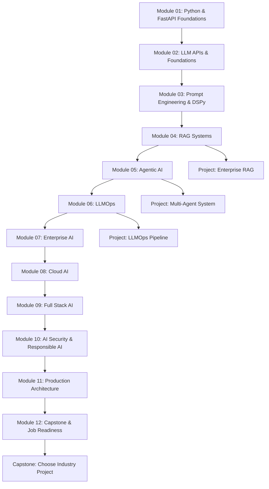

# 5. Complete Learning Roadmap

## Overview

**Duration:** 6 months (intensive) or 12 months (standard)  
**Format:** Modules → Labs → Enterprise Projects → Capstone → Job Readiness  
**Prerequisite:** Programming experience (Python preferred); no PhD math required

## Roadmap Diagram

## Phase-by-Phase Roadmap

### Phase A — Foundations (Weeks 1–4)
| Module | Topics | Outcome |
|--------|--------|---------|
| 01 | Python async, FastAPI, Docker, Git | Production API skeleton |
| 02 | OpenAI, Anthropic, Gemini APIs | Multi-provider LLM service |

**Milestone:** Deployed LLM microservice with health checks and structured logging.

### Phase B — Core GenAI (Weeks 5–10)
| Module | Topics | Outcome |
|--------|--------|---------|
| 03 | Prompt patterns, DSPy, versioning | Optimized prompt pipelines |
| 04 | RAG, vector DBs, hybrid search, reranking | Production RAG with eval scores |

**Milestone:** Enterprise RAG assistant with documented eval metrics.

### Phase C — Agents & Operations (Weeks 11–18)
| Module | Topics | Outcome |
|--------|--------|---------|
| 05 | LangGraph, CrewAI, AutoGen, agents | Multi-agent workflow system |
| 06 | Tracing, eval CI, guardrails, monitoring | LLMOps dashboard |

**Milestone:** Agent system with traces, cost tracking, and regression tests.

### Phase D — Enterprise & Cloud (Weeks 19–26)
| Module | Topics | Outcome |
|--------|--------|---------|
| 07 | Governance, compliance, integrations | Enterprise-ready architecture |
| 08 | AWS, Azure, GCP, K8s, GPU inference | Multi-cloud deployment lab |
| 09 | Next.js, streaming, voice, SaaS patterns | Full-stack AI product |
| 10 | Security, responsible AI, red teaming | Hardened system |

**Milestone:** Full-stack copilot with security review doc.

### Phase E — Production & Career (Weeks 27–52)
| Module | Topics | Outcome |
|--------|--------|---------|
| 11 | System design, scale, cost architecture | Architecture portfolio |
| 12 | Capstone + job readiness | 3–5 GitHub flagship projects |

**Milestone:** Job-ready portfolio + interview prep complete.

## Parallel Project Track

Start projects after Module 04; align with [08-project-portfolio.md](./08-project-portfolio.md):

| Week Range | Project |
|------------|---------|
| 6–8 | Enterprise RAG Assistant |
| 10–12 | AI Customer Support System |
| 14–16 | Autonomous Research Agent |
| 18–20 | Multi-Agent Finance Analyst |
| 22–24 | AI Workflow Automation Platform |
| 26–30 | Capstone (industry vertical of choice) |

## Certification Alignment

See [09-certification-roadmap.md](./09-certification-roadmap.md) — pursue cloud certs in parallel with Modules 07–08.

## Weekly Time Budget

| Track | Hours/Week | Modules/Month |
|-------|------------|---------------|
| Intensive (6 mo) | 25–30 | 2 modules |
| Standard (12 mo) | 12–15 | 1 module |
| Part-time (18 mo) | 8–10 | 0.5–1 module |

---

*Modules: [curriculum/README.md](./curriculum/README.md) | Timeline: [12-6-month-roadmap.md](./12-6-month-roadmap.md)*
